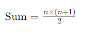

# 高斯算法的原理及其与常规求和方法的区别

|作者|ptw-cwl|
|:---|:---| 
|本文链接|https://docs.ptw-cwl.com/article/3074980826|
|GitHub|https://github.com/ptw-cwl/docs/blob/master/article/3074980826.md|
|CSDN|https://blog.csdn.net/qq_62701769/article/details/139880020|


### 高斯算法的原理
高斯算法的原理源于数学家卡尔·弗里德里希·高斯在他少年时期发现的一种求和方法。当时老师让学生们计算1到100的和，高斯发现了一种快速计算的方法。

高斯注意到，如果将序列的首尾两数相加，结果总是相同的。例如：

```
[ 1 + 100 = 101 ]
[ 2 + 99 = 101 ]
[ 3 + 98 = 101 ]
...
```

这样，一共有50对数，每对数的和都是101。因此，1到100的和可以表示为：

```
Sum = 50 × 101 = 5050
```

一般化，这个公式可以表示为：



其中，n 是要计算的最大整数。

### 常规求和方法
常规求和方法是逐个将每个数相加。这种方法非常直观，适合较小范围的整数求和。对于从1加到100的情况，代码如下：

```java
public class 常规求和 {
    public static void main(String[] args) {
        int sum = 0;
        for (int i = 1; i <= 100; i++) {
            sum += i;
        }
        System.out.println("从1加到100的和是: " + sum);
    }
}
```

### 高斯求和算法
利用高斯算法，我们可以快速计算1到100的和，代码如下：

```java
public class 高斯求和 {
    public static void main(String[] args) {
        int n = 100;
        int sum = n * (n + 1) / 2;
        System.out.println("使用高斯公式从1加到100的和是: " + sum);
    }
}
```

### 比较与总结
高斯算法和常规求和方法在计算效率和思维方式上有显著区别：

1. **计算效率**：
   - 常规方法：时间复杂度为 O(n)，即当 n 增加时，计算时间线性增加。例如，计算1到100的和需要进行100次加法操作。
   - 高斯算法：时间复杂度为 O(1)，不论 n 多大，计算时间几乎不变。例如，计算1到100的和只需要一次乘法和一次除法操作。

2. **思维方式**：
   - 常规方法：基于逐步累加，适合初学者理解和教学目的。代码简单直观，便于理解每一步的计算过程。
   - 高斯算法：基于数学公式，适合快速计算大范围连续整数的和。通过公式一次计算得到结果，高效简洁。

综上所述，高斯算法通过数学公式大大提高了计算效率，适用于需要快速计算连续整数和的情况，而常规求和方法则适合较小范围的和或用于教学目的。选择哪种方法取决于具体的应用场景和需求。