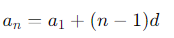
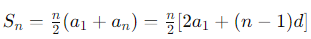
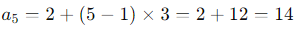
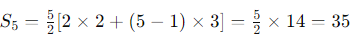
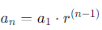
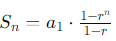
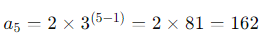

# 等差数列和等比数列的介绍及在Java编程中的实现


|作者|ptw-cwl|
|:---|:---| 
|本文链接|https://docs.ptw-cwl.com/#/article/4144527851|
|GitHub|https://github.com/ptw-cwl/docs/blob/master/article/4144527851.md|
|CSDN|https://blog.csdn.net/qq_62701769/article/details/139880263|
|掘金|https://juejin.cn/post/7383894634157408265|
|知乎|https://zhuanlan.zhihu.com/p/705144645|


### 等差数列 (Arithmetic Sequence)

**定义**：等差数列是指相邻两项的差相等的数列，这个差值叫做“公差” d。

**公式**：
- 第 n 项的公式：



- 前 n 项和的公式：

 

**示例**：
假设第一项 a1 为 2，公差 d 为 3：

等差数列的前 5 项为：2, 5, 8, 11, 14
- 第 5 项：


- 前 5 项和：

 


**Java 实现**：

生成等差数列的第 n 项：
```java
public class ArithmeticSequence {
    public static int nthTerm(int a1, int d, int n) {
        return a1 + (n - 1) * d;
    }

    public static void main(String[] args) {
        int a1 = 2; // 第一项
        int d = 3;  // 公差
        int n = 5;  // 第 n 项

        int nthTerm = nthTerm(a1, d, n);
        System.out.println("第 " + n + " 项是: " + nthTerm);
    }
}
```

计算等差数列的前 n  项和：
```java
public class ArithmeticSequence {
    public static int sumOfTerms(int a1, int d, int n) {
        return n * (2 * a1 + (n - 1) * d) / 2;
    }

    public static void main(String[] args) {
        int a1 = 2; // 第一项
        int d = 3;  // 公差
        int n = 5;  // 前 n 项

        int sum = sumOfTerms(a1, d, n);
        System.out.println("前 " + n + " 项的和是: " + sum);
    }
}
```

### 等比数列 (Geometric Sequence)

**定义**：等比数列是指相邻两项的比值相等的数列，这个比值叫做“公比”（r）。

**公式**：
- 第  n  项的公式：



- 前  n  项和的公式（当  r 不等于1 ）：




**示例**：
假设第一项 a1 为 2，公比 r 为 3：

等比数列的前 5 项为：2, 6, 18, 54, 162
- 第 5 项：



- 前 5 项和：


**Java 实现**：

生成等比数列的第 n  项：
```java
public class GeometricSequence {
    public static double nthTerm(double a1, double r, int n) {
        return a1 * Math.pow(r, n - 1);
    }

    public static void main(String[] args) {
        double a1 = 2; // 第一项
        double r = 3;  // 公比
        int n = 5;     // 第 n 项

        double nthTerm = nthTerm(a1, r, n);
        System.out.println("第 " + n + " 项是: " + nthTerm);
    }
}
```

计算等比数列的前 n 项和：
```java
public class GeometricSequence {
    public static double sumOfTerms(double a1, double r, int n) {
        if (r == 1) {
            return a1 * n;
        }
        return a1 * (1 - Math.pow(r, n)) / (1 - r);
    }

    public static void main(String[] args) {
        double a1 = 2; // 第一项
        double r = 3;  // 公比
        int n = 5;     // 前 n 项

        double sum = sumOfTerms(a1, r, n);
        System.out.println("前 " + n + " 项的和是: " + sum);
    }
}
```

### 总结

**等差数列**和**等比数列**是数学中的两种重要序列。等差数列的特点是相邻两项的差相等，通过线性递增或递减生成。等比数列的特点是相邻两项的比值相等，通过指数递增或递减生成。在Java编程中，利用基本的数学公式和循环、递归等编程技术，可以方便地实现这两种数列的生成和求和计算。

通过上述例子和Java代码的实现，我们可以清晰地理解等差数列和等比数列的概念及其在实际编程中的应用和区别。这些基本的数列概念在各种算法和数据处理任务中有着广泛的应用，理解并掌握它们对于提高编程能力和解决实际问题有着重要意义。
