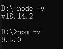
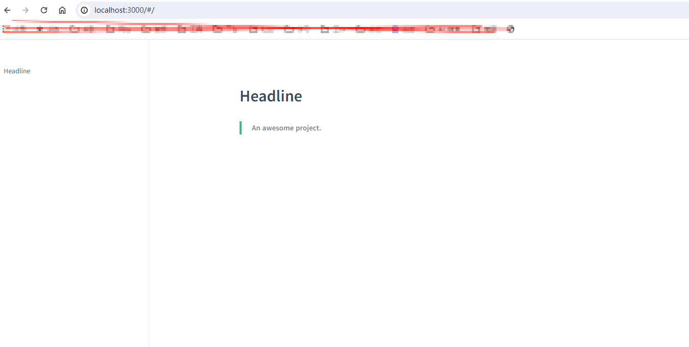

# 从零开始使用 Docsify 搭建文档站点

## 引言

在当今的技术环境中，拥有一份易于访问和美观的文档是至关重要的。Docsify 是一个非常适合快速搭建文档站点的工具，它简单易用，且不需要生成静态文件。本文将带你一步步从零开始使用 Docsify 搭建一个文档站点。

## 1. 安装 Node.js 和 npm

在开始之前，你需要安装 Node.js 和 npm（Node 包管理器）。你可以从 [Node.js 官网](https://nodejs.org/zh-cn) 下载并安装适用于你操作系统的安装包。

安装完成后，打开命令行工具（如终端或命令提示符），运行以下命令来检查是否安装成功：

```bash
node -v
npm -v
```

如果你看到 Node.js 和 npm 的版本号，说明安装成功。

**示例:**



## 2. 安装 docsify-cli

全局安装 docsify-cli，命令：

```bash
npm install -g docsify-cli
```

## 3. 初始化项目

选择一个目录用来存放你的文档，并在该目录下初始化一个新的 Docsify 项目。

### 步骤：

1. 移动到存放文档的目录，命令：

```bash
cd 目录路径
```

> **注意:** 如果不在一个盘符中需要先切换盘符，然后再移动。例如，切换到 D 盘的命令是 `D:`。

2. 初始化 Docsify 项目。如果你想在项目的 `./docs` 目录里写文档，直接通过 init 初始化项目，命令：

```bash
docsify init ./docs
```

> 注意：是 `docs` 目录，不是根目录。

这个命令将在 `docs` 目录下创建一个基本的 Docsify 项目结构：

```
docs
  ├─ .nojekyll
  ├─ index.html
  ├─ README.md
```

- `index.html`：入口文件

- `README.md`：作为主页内容渲染

- `.nojekyll`：用于阻止 GitHub Pages 忽略掉下划线开头的文件

- 直接编辑 `docs/README.md` 就能更新文档内容。

### index.html 初始内容展示：

```html
<!DOCTYPE html>
<html lang="en">
<head>
  <meta charset="UTF-8">
  <title>Document</title>
  <meta http-equiv="X-UA-Compatible" content="IE=edge,chrome=1" />
  <meta name="description" content="Description">
  <meta name="viewport" content="width=device-width, initial-scale=1.0, minimum-scale=1.0">
  <link rel="stylesheet" href="//cdn.jsdelivr.net/npm/docsify@4/lib/themes/vue.css">
</head>
<body>
  <div id="app"></div>
  <script>
    window.$docsify = {
      name: '',
      repo: ''
    }
  </script>
  <!-- Docsify v4 -->
  <script src="//cdn.jsdelivr.net/npm/docsify@4"></script>
</body>
</html>
```

## 4. 本地预览

通过运行 `docsify serve` 启动一个本地服务器，可以方便地实时预览效果。

默认访问地址是 `http://localhost:3000`。

```bash
docsify serve docs
```
**页面展示:**



---

通过以上步骤，你就可以使用 Docsify 从零开始搭建一个美观且功能强大的文档站点。Docsify 的简单易用和高度可配置性使其成为搭建文档站点的理想选择。如果你有任何问题或需要进一步的帮助，请随时联系我！